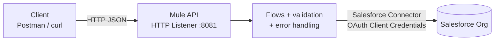

# Salesforce Accounts CRUD API (MuleSoft)

A REST API built with **MuleSoft (Mule 4)** that exposes Create / Read / Update / Delete operations on **Salesforce Accounts**. Any HTTP client (Postman, curl, a web app) can manage Salesforce data through this API without talking to Salesforce directly.

The project authenticates to Salesforce with the **OAuth 2.0 Client Credentials** flow (no username, password or security token stored anywhere).

## Architecture



## Tech stack

| Component | Version |
|---|---|
| Mule runtime | 4.12.3 |
| Java | 17 |
| Salesforce Connector | 11.4.0 |
| HTTP Connector | 1.12.1 |
| IDE | VS Code + Anypoint Code Builder |

## Endpoints

| Method | Path | Description |
|---|---|---|
| GET | `/health` | Liveness check |
| GET | `/accounts` | List accounts (first 10) |
| GET | `/accounts/{id}` | Get one account |
| POST | `/accounts` | Create an account |
| PUT | `/accounts/{id}` | Update an account (partial update) |
| DELETE | `/accounts/{id}` | Delete an account |

### Request bodies

`POST /accounts` (only `name` is required):

```json
{
  "name": "Acme Corp",
  "industry": "Technology",
  "phone": "0123456789"
}
```

`PUT /accounts/{id}` (send at least one of the fields; omitted fields are left unchanged):

```json
{
  "phone": "0100000000",
  "industry": "Finance"
}
```

### Responses and error handling

| Scenario | Status | Body |
|---|---|---|
| Account created | 201 | `{"id": "...", "message": "Account created"}` |
| Account updated / deleted | 200 | `{"id": "...", "message": "Account updated"}` / `"Account deleted"` |
| Get by id, found | 200 | The account object |
| Missing `name` on create | 400 | `{"error": "BAD_REQUEST", "message": "Field 'name' is required"}` |
| Invalid Salesforce Id format | 400 | `{"error": "BAD_REQUEST", "message": "Invalid Account Id format"}` |
| Empty body on update | 400 | `{"error": "BAD_REQUEST", "message": "Send at least one of: name, industry, phone"}` |
| Account does not exist (or already deleted) | 404 | `{"error": "NOT_FOUND", "message": "Account not found"}` |
| Salesforce unreachable / token failure | 503 | `{"error": "SERVICE_UNAVAILABLE", ...}` |
| Anything unexpected | 500 | Generic message (details are only written to the log) |

Salesforce Ids are validated (15 or 18 alphanumeric characters) before they are used in a query.

## Salesforce setup

1. Create a free [Developer Org](https://developer.salesforce.com/signup).
2. In **Setup**, open **External Client App Manager** and create an app:
   - Enable OAuth settings and add the scopes `api` and `refresh_token, offline_access`.
   - Enable the **Client Credentials Flow**.
3. In the app's **Policies**, set the **Run As** user for the Client Credentials flow.
4. Copy the **Consumer Key** and **Consumer Secret** (Settings, then OAuth Settings).
5. Find your **My Domain** URL under Setup, then My Domain. The token URL is `https://<your-domain>.my.salesforce.com/services/oauth2/token`.

Allow a few minutes after saving before the app starts accepting requests.

> **Note:** the connector's Basic Authentication option is only supported up to Salesforce API v64, which is why this project uses OAuth.

## Configuration

Copy the example file and fill in your values:

```
src/main/resources/config.properties.example  ->  src/main/resources/config.properties
```

```properties
http.host=0.0.0.0
http.port=8081

sf.clientId=YOUR_CONSUMER_KEY
sf.clientSecret=YOUR_CONSUMER_SECRET
sf.tokenUrl=https://YOUR-DOMAIN.my.salesforce.com/services/oauth2/token
```

`config.properties` is listed in `.gitignore`. **Never commit it.**

## Run locally

1. Install **JDK 17** and VS Code with the **Anypoint Extension Pack**.
2. Open the project, create `config.properties` as described above.
3. Run the application with **Run Mule Application** (Run and Debug panel).
4. Wait for the console to show the application as `DEPLOYED`.
5. Test it:

```bash
curl http://localhost:8081/health
curl http://localhost:8081/accounts
curl -X POST http://localhost:8081/accounts \
  -H "Content-Type: application/json" \
  -d '{"name":"Acme Corp","industry":"Technology"}'
curl -X PUT http://localhost:8081/accounts/<ID> \
  -H "Content-Type: application/json" \
  -d '{"phone":"0100000000"}'
curl -X DELETE http://localhost:8081/accounts/<ID>
```

### Troubleshooting: `PKIX path building failed`

If the token call fails with `SSLHandshakeException: PKIX path building failed`, Java does not trust the certificate presented on your network (common with corporate proxies or antivirus HTTPS scanning). On Windows you can make Java use the Windows certificate store:

```powershell
setx JAVA_TOOL_OPTIONS "-Djavax.net.ssl.trustStoreType=WINDOWS-ROOT"
```

Then fully restart VS Code so the variable is picked up.

## Project structure

```
src/main/mule/
  global-configs.xml                  # HTTP listener + Salesforce OAuth config
  salesforce-accounts-crud-api.xml    # flows, validation, global error handler
src/main/resources/
  config.properties.example           # template (real file is git-ignored)
  log4j2.xml
pom.xml
mule-artifact.json
```

## Limitations and possible next steps

- The list endpoint returns the first 10 accounts with no pagination or filtering.
- Only `Name`, `Industry` and `Phone` are mapped.
- The API itself has no inbound authentication, so do not expose it publicly as is. API Manager policies (client ID enforcement, OAuth) would be the natural next step.
- Add MUnit tests and deploy to CloudHub.
- Design the contract first with RAML/OpenAPI.

## Screenshots

_Add Postman screenshots here (create, read, update, delete, and an error case). Hide any keys, secrets or tokens before saving them._
